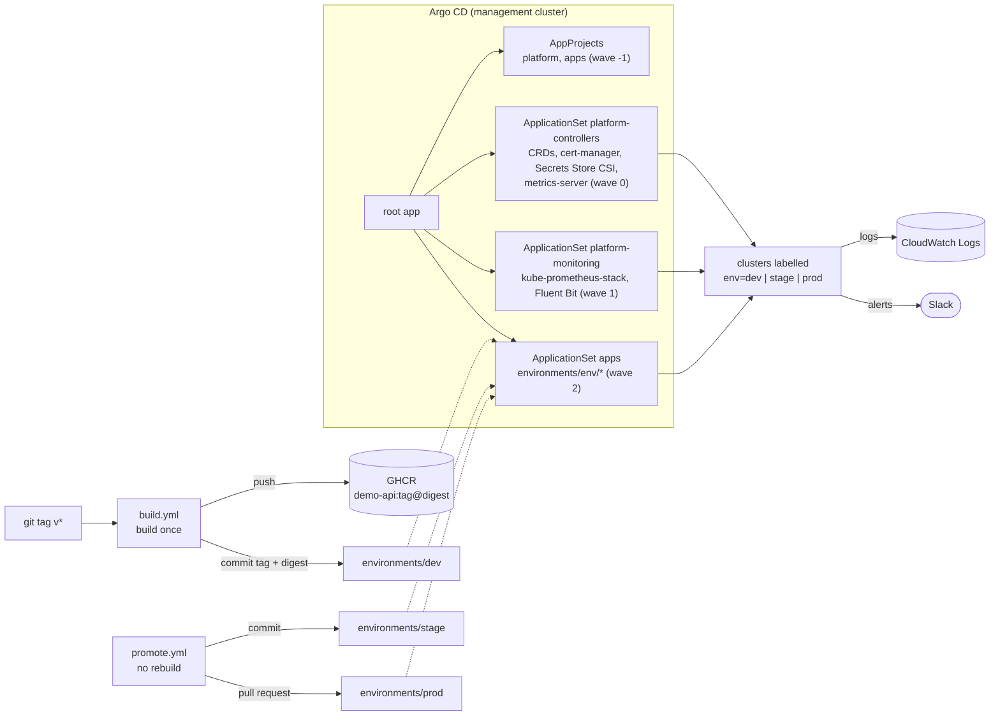

# Architecture

```mermaid
flowchart LR
  tag["git tag v*"] --> build["build.yml<br/>build once"]
  build -->|push| ghcr[("GHCR<br/>demo-api:tag@digest")]
  build -->|commit tag + digest| dev["environments/dev"]
  promote["promote.yml<br/>no rebuild"] -->|commit| stage["environments/stage"]
  promote -->|pull request| prod["environments/prod"]

  subgraph argocd["Argo CD (management cluster)"]
    root["root app"] --> projects["AppProjects<br/>platform, apps (wave -1)"]
    root --> controllers["ApplicationSet platform-controllers<br/>CRDs, cert-manager, Secrets Store CSI,<br/>metrics-server (wave 0)"]
    root --> monitoring["ApplicationSet platform-monitoring<br/>kube-prometheus-stack, Fluent Bit (wave 1)"]
    root --> apps["ApplicationSet apps<br/>environments/env/* (wave 2)"]
  end

  controllers --> clusters["clusters labelled<br/>env=dev | stage | prod"]
  monitoring --> clusters
  apps --> clusters
  dev -.-> apps
  stage -.-> apps
  prod -.-> apps
  clusters -->|logs| cw[("CloudWatch Logs")]
  clusters -->|alerts| slack(["Slack"])
```
